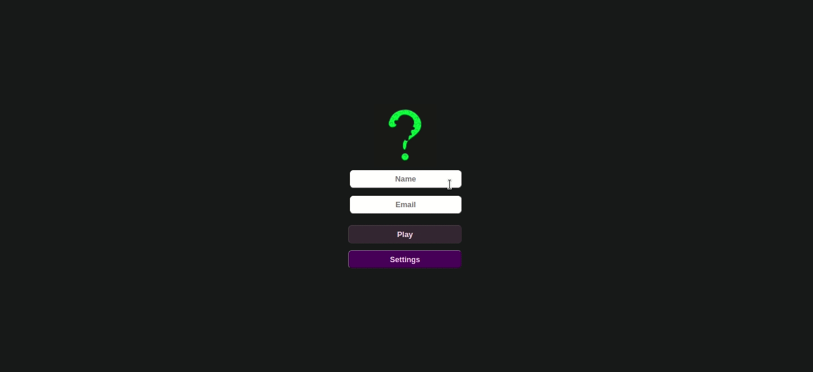

# Projeto Jogo de Trivia

:rocket: ***Projeto em grupo** desenvolvido em 04/2022 - Bloco 16/Trybe*



## :dart: Objetivo

Desenvolver um jogo de perguntas e respostas baseada em jogos de Trivia

O usuário deverá logar para ter acesso ao jogo em que serão realizadas 5 perguntas aleatórias com timer de 30 segundos para a resposta e ao final será exibido seu placar com a opção de ver sua posição no ranking do jogo

### Regras

- Serão 5 perguntas e o jogador terá 30 segundos para responder a cada uma delas
- A resposta deverá ser escolhida dentro do tempo delimitado, caso contrário a resposta é considerada incorreta
- O placar será exibido ao final das respostas
- Será possível aumentar seu placar jogando novamente com o mesmo email logado anteriormente

## :brain: Habilidades desenvolvidas

**Hard Skills**

- Utilizar React para o desenvolvimento
- Gerenciar o estado com Redux: *store*, *reducers*, *actions*
- Conectar o Redux com os componentes do React, utilizando o *connect* para *mapStateToProps*, *mapDispatchToProps*
- Efetuar a validação das props com PropTypes
- Realizar a requisição das APIs

**Soft Skills**

- Gestão do projeto com o *Método Kanban*
- Escuta ativa
- Comunicação assertiva
- Trabalho em equipe
- Pensamento crítico

## :hammer_and_wrench: Ferramentas utilizadas

- CSS
- React
- React Componenents
- Redux com React
- Redux Thunk
- [API Trivia](https://opentdb.com/api_config.php)
- [API Gravatar](https://br.gravatar.com/site/implement/)
- Trello
- Zoom

:zap: *Todos os projetos da [Trybe](https://www.betrybe.com/?utm_medium=cpc&utm_source=google&utm_campaign=Brand&utm_content=ad03_din_h&gclid=Cj0KCQjw852XBhC6ARIsAJsFPN0TgLB25i-0iaTXpXGAYC5i-3mDoTto4laUGYI5XZFJpSlNbrojLuUaAs6cEALw_wcB) utilizam Linters, Git e Github*

## :rocket: Equipe

| [ <br> <sub> Alector Alexander </sub>](https://github.com/AlectorAlexander) | [<br> <sub> Jacqueline Silva </sub>](https://github.com/Jacqueline-Silva) | [<br> <sub> Queite Castiglioni </sub>](https://github.com/queite) |
| :---: | :---: | :---: |

## :pushpin: Rodando localmente

Clone o projeto e entre no diretório

```bash
  git clone git@github.com:Jacqueline-Silva/trivia.git && cd trivia
```

Instale as dependências

```bash
  npm install
```

Inicie a aplicação

```bash
  npm run start
```

## :mailbox: Contatos

[](https://www.linkedin.com/in/jacqueline-sxds/)
[](https://jacqueline-silva.github.io/)
[](https://github.com/Jacqueline-Silva)
[](http://wa.me/5511946162157)
[](jacque.sx@hotmail.com)
